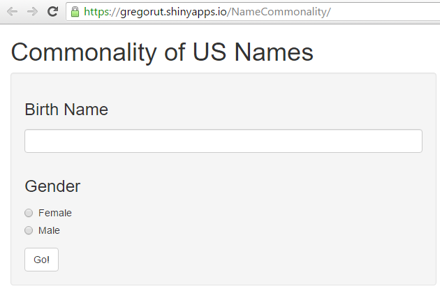
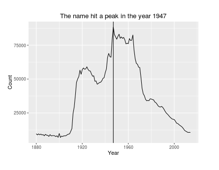

## Name Commonality Tracking
The Name Commonality tracks the usage of names given at birth.

-National Data on the relative frequency of given names in the population of
U.S. births where the individual has a Social Security Number.

-The Data used by this tool inludes data from 1880-2014.

-Due to privacy issues.  
   Data.Gov will not publish names used fewer than five times in a single year.

-The Raw Data is available at: 

https://catalog.data.gov/dataset/baby-names-from-social-security-card-applications-national-level-data

---
## Accessing the tool

The name commonality tool is located at

https://gregorut.shinyapps.io/NameCommonality/

---
## Using the tool
 

* Enter name in the text box

* Select Gender

---
## Understanding the Results
 

The plot:
Shows the useage of the name for births vs. the year
shows a verticle line that represents the peak usage of the name
